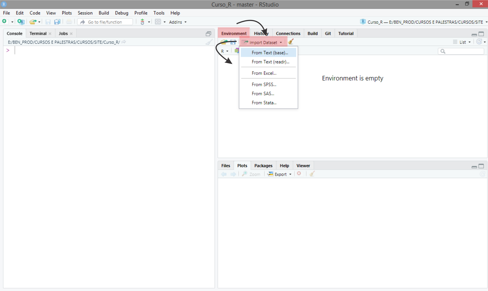
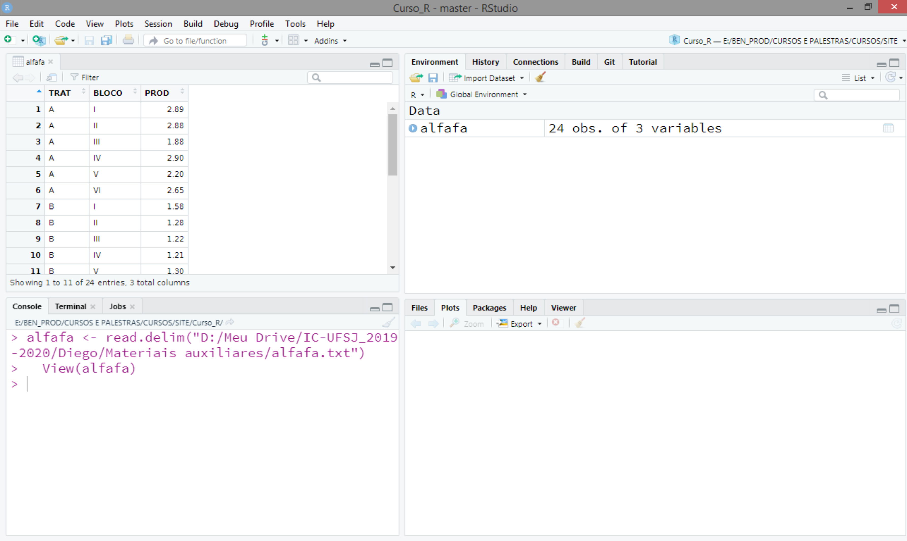

```{r setup, include=FALSE}
knitr::opts_chunk$set(echo = TRUE)
```
--- 

# Objetivo

Descrever as ideias básicas sobre o ambiente R:

 - Como instalar o R e RStudio;
 - Diferenças entre o R e a IDE RStudio;
 - Como o R trabalha;
 - Comandos elementares;
 - Objetos;
 - Manipulação com objetos;
 - Importação de dados;
 - Pacotes:
   - Instalação;
   - Como usar.
 

# Apresentação do relatório

Diante do objetivo do relatório apresentaremos nas próximas subseções, os pontos a serem discutidos.

## Como instalar o R e RStudio

 - [Instalação do R](https://cran.r-project.org/bin/windows/base/)
 - [Instalação do RStudio](https://www.rstudio.com/products/rstudio/download/#download)

## Diferenças entre o R e a IDE RStudio

 - **Interface** 
 
   {width="70%"}
  
   {width="70%"}
 
 - **Vantagens e desvantagens** 
   
   - No ambiente R os usuários podem vir a ter problemas ao utiliza-lo, uma vez que as janelas gráficas, janelas de scrip, entre outras se sobrepõem. Já no RStudio, há em sua interface 4 quadrantes que possibilitam a visualização de todo o trabalho, tornando-o mais organizado.
   
## Como o R trabalha 
 
 - Três princípios do R 
 
   - **Princípio do objeto**: Tudo que existe em R é um objeto. 
   - **Princípio da função**: Tudo que acontece no R é uma chamada de função.
   - **Princípio da interface**: Interfaces para outros programas são parte do R.
 
 - Ao trabalhar no ambiente R, toda ação feita é uma chamada de função (Operadores e funções), a qual é armazenada na forma de um objeto e assim associada à um nome.
 - A execução dessas funções, tendo em vista a entrada, é baseada em argumentos (dados, fórmulas, expressões, entre outros) ou argumentos padrões que já são pré-estabelecidos  na criação da função.
 - Por último, a saída é o resultado que também é um objeto, podendo ser usado como argumento de outras funções.

## Comandos elementares 

 - **Console** : Tela de inserir e visualizar os comandos. 
 - **Prompt de comando** : Símbolo ">", que nos diz: "pronto, pode inserir os comandos!" 
 
 - Os comandos elementares são divididos em dois tipos: **Expressões** e **Atribuições**
 
   - **Expressões**: São qualquer linha de comando em que o R avalia a informação, processa e dá o resultado, o qual não é recuperado. 
   
      ` > 20 + 8 `
      
      `[1] 28 `
       
   - **Atribuições**: Ela associa um nome à um objeto e essa informação pode ser recuperada.
      
      ` > meu_nome <- "Ana Bárbara" `
      
      *Para imprimir o resultado da expressão, digitamos o nome*
      *"meu_nome" no console e apertamos o botão ENTER do teclado!*
      
      `[1] Ana Bárbara`

## Objetos 

 - De acordo com John Chambers,tudo que existe em R é um objeto (Princípio 2).
 - Um objeto dentro do ambiente R além de armazenar informações específicas, ele possui características próprias quanto à sua estrutura e conteúdos.
   
   - **Atributos**: Definem as estruturas e comportamentos 
   - **Atributos intrísecos**: 
     - **Modo**: É a característica que existe nos elementos do objeto (funções,valores,entre outros).
       
         - Funções usadas para determinar o modo de um objeto:
           - **mode()**: Linguagem **S**
           - **typeof()**: Linguagem **C**
          
     - **Comprimento**: é o número de elementos que há dentro do objeto.
         - Função usada para determinar o comprimento do objeto:
           - **lenght()**
           
## Manipulação com objetos

- **Tipos de objetos**: Determina a estrutura de como os dados estão organizados em um objeto relacionado aos seus atributos.Estão subdivididos em dois:

  **Vetores**
   
   - **Vetores atômicos**: 
     - Lógicos,Numéricos e Caracteres
     - Matrizes unidiemnsionais (*Matrix*) e multidimensionais (*Arrays*)
     
       - **Numéricos** (numerico):
         - Inteiro (integer)
         - Real (double)
       - **Lógico** (logical)
       - **Caractere** (character)
       
     **Escalares**: O menor comprimento de um vetor é de tamamanho um, conhecido também como um escalar. Porém, para o R tudo é observado como um vetor.
       
       - Os vetores lógicos assumem valores: TRUE ou FALSE
       - Os vetores numéricos do tipo double podem ser representados na forma decimal (0.254), científica (1.54e3), ou hexadecimal (2F0G)
       - Os vetores numéricos do tipo integer são representados pela letra L ao final do núemro inteiro , isto é (3L, 1.54e3L, etc.)
       - Os caracteres são representados pelas palavras, letras, números ou caracteres especiais entre aspas, isto é, "Ana Bárbara", "b". Pode ser utilizado também aspas simpels, 'Ana Bárbara', 'b', etc.
    
     **Vetores longos**: Os vetores longos podem ser criados pela função c(), inicial de concatenar,ou seja, agrupar.
     
     #Criando um vetor 'double'
     
     vetor.num <- c(1, 2, 3, 4, 5); vetor.num
     
     [1] (1, 2, 3, 4, 5)
   
  - **Vetores em listas**:
     - Listas (*Lists*)
     - Quadro de dados (*Date frames*)
     
## Importando dados

  - **Ideias básicas**:
    - Escrever um banco de dados 
    - No R:
      - Verificar diretório de trabalho 
      - Importar os dados usando **read.tabel()**
      - Criar um nome e associar ao objeto de classe **data.frame** com os dados importados
    - No RStudio tem alguns recursos que podem facilitar a importação de dados.
    
      - **Passo 1**:
      {width="70%"}
      
      - **Passo 2**: Escolher o arquivo para leitura de dados.
      {width="70%"}
      
      - **Passo 3**: Configurar a leitura de banco de dados. Assim, deverá digitar o nome associado ao objeto (*Name*) que será criado do tipo quadro de dados (*data frame*) e clicar no botão *Import*.
      {width="70%"}
      
      - **Passso 4**: Após inserido, o RStudio apresenta a linha de comando utilizada para importar os dados no console (2º quadrante), o conjunto de dados (1º quadrante), e a ligação entre o nome e o obejto no ambiente global (3º quadrante).
      {width="70%"}

## Pacotes

  - **Instalação**:
 
    - A instalação de um pacote via CRAN pode ser feita pela função:
    install.packages(pkgs = "nome_pacote")
    - Para baixar o pacote fonte na internet, basta usar a url: http://cran.r-project.org/package=midrangeMCP. Para qualquer outro pacote, basta mudar o nome do pacote na url
    - O pacote fonte é compactado com a extensão .tar.gz 
    - Outra maneira é baixar o arquivo do pacote fonte no seu computador e instalá-lo.
  
  - **Como usar**:
  
    - Após a instalação do pacote, é necessário carregar e anexa-lo, para que seja possível a utilização dos recursos disponíveis nele, como funções, dados, etc.Sendo assim, isso significa disponibilizar na memória e inseri-lo no caminho de busca.Para isso, deve-se usar as funções library() ou require().
    - Para acessar uma função de um pacote após ter sido carregado, usa-se o operador ::,ou seja, nome_pacote::nome_função.Isto significa, que será chamado a função necessária sem anexar o pacote no caminho de busca.
      - **Caminho de busca**: Objetos que armazenam, em forma de lista, nomes associados a objetos. A função para ver o caminho de busca é search().
  

      
      
      
      
      
      
      
    
      


     
    


   
      


