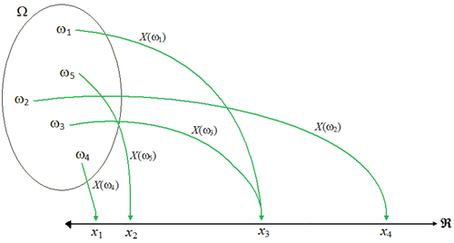
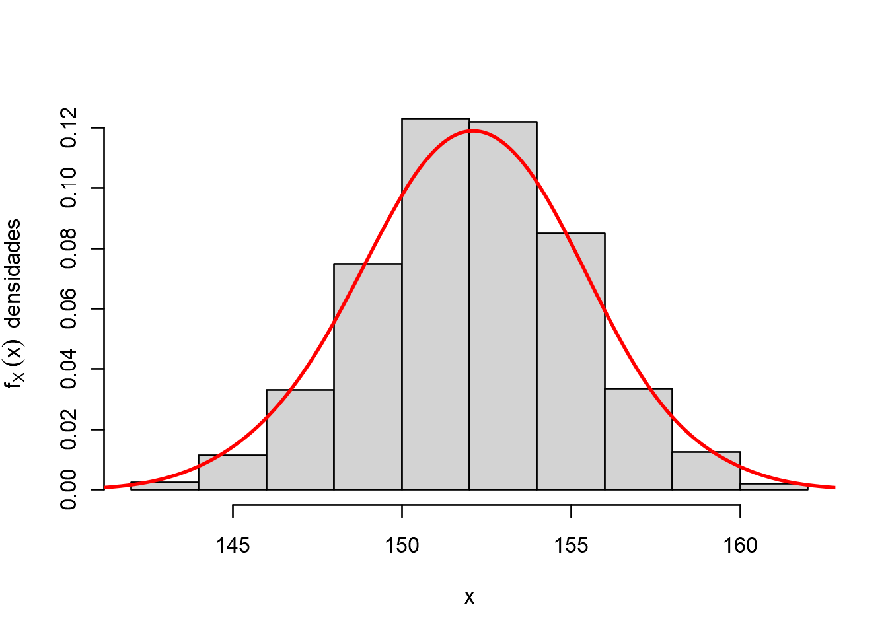
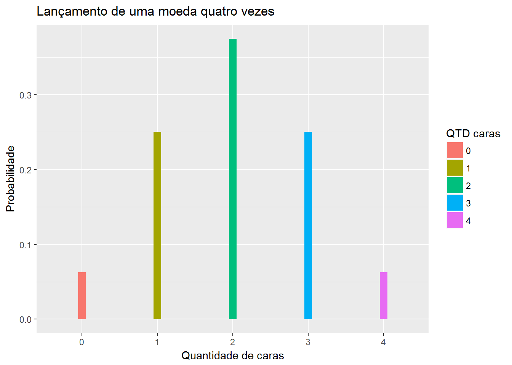
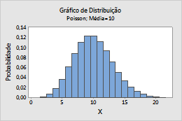
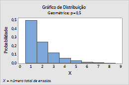
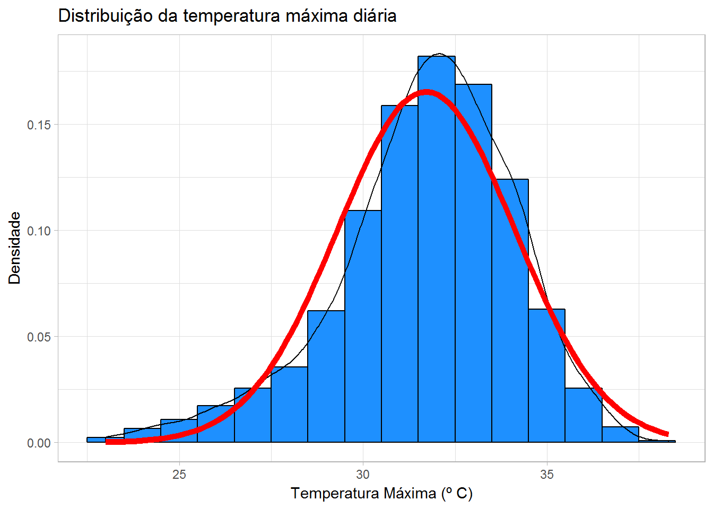

```{r setup, include=FALSE}
knitr::opts_chunk$set(echo = FALSE)
```


## Objetivos
  
  O objetivo desse relatório é detalhar os conceitos básicos das distribuições de probabilidade e o seu uso no ambiente R.


## Introdução

### **Probabilidade** 

  É o estudo das chances de obtenção de cada resultado de um experimento aleatório. A essas chances são atribuídos os números reais do intervalo entre 0 e 1. Resultados mais próximos de 1 têm mais chances de ocorrer. Além disso, a probabilidade também pode ser apresentada na forma percentual.
  
### **Espaço Amostral (Ω)**

  É o conjunto formado por todos os resultados possíveis de um experimento aleatório. Em outras palavras, é o conjunto formado por todos os pontos amostrais de um experimento. 

## Introdução
  
### **Variável aleatória**

  - As variáveis aleatórias associam o evento a um número real. É denotada pela letra maiúscula, **X** OU **X(.)** .
  - É uma função com domínio em Ω e imagem no conjunto dos reais B, tal que B = {x ∈ R : X(ω) = x, ω ∈
Ω}.

<center>
   {width=50%}</center>
## Distribuições de probabilidade 

### **Variáveis discretas:**
  - Suporte em um conjunto de valores enumeráveis (finitos ou infinitos)
  
### **Variáveis contínuas:** 
  - Suporte em um conjunto não enumerável de valores infinitos.

## Distribuições de probabilidade 

### **Função de probabilidade:** 
  - É a função que atribui cada valor xi da variável aleatória discreta X sua probabilidade de ocorrência.Então a função é dada da seguinte forma: 
                    **P(X = xi) = pX(xi) = pi,**
                       **i = 1, 2, . . .**
  
### **Função de densidade de probabilidade:**
  - Não pode-se atribuir probabilidades à valores específicos, pois há uma quantidade não enumerável (infinita) de valores em um ponto. 
  - Portanto, as probabilidades são atribuídas à intervalos de valores, por meio de uma função e assim, são representadas por áreas. 

## Distribuições de probabilidade

  <center>
   {width=50%}</center>

## Tipos de distribuições probabilísticas 

### **Normal**
  - A distribuição Normal é a mais familiar das distribuições de probabilidade e também uma das mais importantes em estatística.
  - A grande utilidade dessa distribuição (função densidade de probabilidade) está associada ao fato de que aproxima de forma bastante satisfatória as curvas de frequências de medidas físicas, essa curva é conhecida como distribuição normal 
  
## Tipos de distribuições probabilísticas 

  - A distribuição normal possui dois parâmetros, a média (μ), ou seja onde está centralizada e a variância (σ2>0) que descreve o seu grau de dispersão. Ainda, é comum se referir a dispersão em termos de unidades padrão, ou seja desvio padrão (σ). Cabe salientar que como qualquer outro modelo, dependendo dos parâmetros, teremos diferentes distribuições normais.
  
  <center>
   {width=40%}</center>
## Tipos de distribuições probabilísticas

  - Parâmetros:
     - μ  é a média da distribuição
     - σ2 é a varância da distribuição
     - σ é o desvio padrão da distribuição
     
## Tipos de distribuições probabilísticas

### **Binomial** 
  - A distrubuição Binomial procede do experimento de Bernoulli e é aplicada em casos de experimentos repetidos, onde existem dois possíveis resultados: cara ou coroa, sucesso(1) ou fracasso(0), item defeituoso ou item não defeituoso, e muitos outros possíveis pares.

 <center>
   {width=40%}</center>


## Tipos de distribuições probabilísticas

### **Poisson** 
  - A distribuição de Poisson é aplicável quando o número de possíveis ocorrências discretas é muito maior do que o número médio de ocorrências em um determinado intervalo de tempo ou espaço. 
  
 <center>
   {width=40%}</center>
   
## Tipos de distribuições probabilísticas

### **Geométrica** 
  - A variável aleatória geométrica é a única distribuição discreta com a propriedade de falta de memória que implica que se o experimento for iniciado em qualquer tentativa, não irá alterar a sua distribuição de probabilidades, ou seja a avaliação das probabilidades se iniciarem após algumas tentativas a distribuição não será afetada.
  
  <center>
   {width=40%}</center>
## Distribuições de probabilidade no R

  - o R inclui algumas operações com as distribuições de probabilidade. Sendo assim, existem 4 operações básicas indicadas por letras: 
  
    - **d** calcula a densidade de probabilidade **f(x)** no ponto;
    - **p** calcula a função de probabilidade acumulada **F(x)** no ponto;
    - **q** calcula o quantil correspondente a uma dada probabilidade;
    - **r** gera uma amostra aleatória da distribuição.
    
    - **size** representa o número de de tentativas do evento 
    - **prob** é a probabilidade de um resultado positivo 
    
## Distribuições de probabilidade no R

### **Calculando a distribuição Binomial no R**

  - **1 - Ocorrer extamente 2 caras em 4 lançamentos de uma moeda**

```
dbinom (x=3, #Calcula a probabilidade de P(X=x)

  size=4, #Quantidade total de lançamentos
  
  prob=0.5, #Probabilidade inicial de ocorrer o sucesso
  
  log= FALSE)
```
```{r}
dbinom (x=3, #Calcula a probabilidade de P(X=x)

  size=4, #Quantidade total de lançamentos
  
  prob=0.5, #Probabilidade inicial de ocorrer o sucesso
  
  log= FALSE)
```

## Distribuições de probabilidade no R

### **Calculando a distribuição Normal no R**

  - **2 - Cálculo da probabilidade, em um únido dia, a temperatura máxima ser superior à 36ºC **
  <center>
   {width=40%}</center>

## Distribuições de probabilidade no R

### **Calculando a distribuição Normal no R**
```
pnorm (q = 36, #x=36
       mean = 31.71, #media
       sd = 2.41, #desvio padrão
       lower.tail = FALSE #Calculada P[X > x]
       )
```
```{r}
pnorm (q = 36, #x=36
       mean = 31.71, #media
       sd = 2.41, #desvio padrão
       lower.tail = FALSE #Calculada P[X > x]
       )
```


